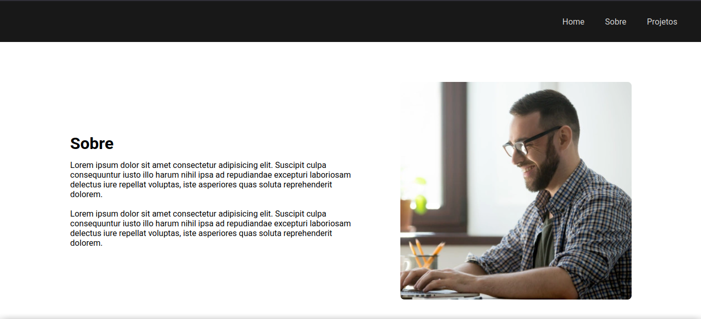
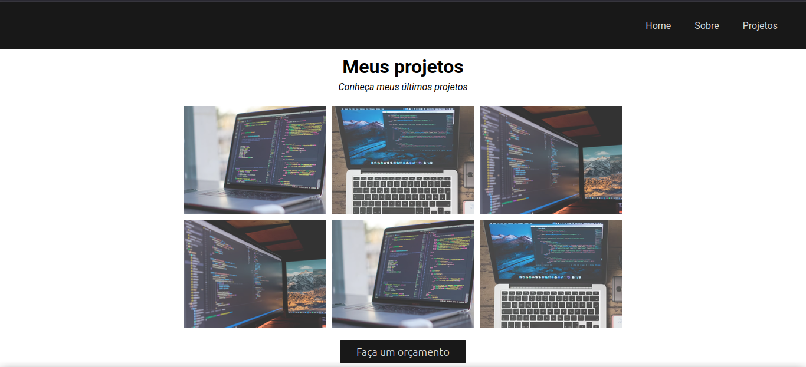

# 💻 Meu Primeiro Projeto HTML

Um projeto de **portfólio pessoal desenvolvido com HTML e CSS**, criado como exercício prático para aprender os fundamentos do desenvolvimento web.

O projeto apresenta uma página simples e responsiva, com navegação entre seções, apresentação pessoal e uma área destinada à exibição de projetos.

## 🚀 Demonstração

🌐 **Acesse o projeto online:**

[Meu Primeiro Projeto HTML](https://pcfsilva.github.io/01-primeiro-projeto-html/)

## 📌 Sobre o projeto

Este projeto foi desenvolvido com o objetivo de colocar em prática os primeiros conhecimentos em **HTML5 e CSS3**, criando uma página de portfólio com uma estrutura simples, organizada e visualmente agradável.

A página possui:

* 🏠 Seção **Home**
* 👨‍💻 Seção **Sobre**
* 💼 Seção **Projetos**
* 📱 Layout adaptado para diferentes tamanhos de tela
* 🧭 Menu de navegação
* 🎨 Estilização personalizada com CSS
* 🖼️ Imagens utilizadas para composição visual do projeto

## 🛠️ Tecnologias utilizadas

### HTML5

Utilizado para criar a estrutura e organização dos elementos da página.

### CSS3

Utilizado para estilização, layout, cores, espaçamentos, navegação e organização dos elementos.

### Google Fonts

O projeto utiliza a fonte **Roboto** através do Google Fonts.

## 📂 Estrutura do projeto

```text
01-primeiro-projeto-html/
│
├── images/
│   ├── foto-pc.png
│   ├── programador.png
│   ├── projeto1.png
│   ├── projeto2.png
│   └── projeto3.png
│
├── index.html
├── style.css
└── README.md
```

## 🖥️ Estrutura da página

### Home

A página inicial apresenta uma mensagem de boas-vindas e uma chamada para conhecer os projetos.
![Imagem do Home da página] (./images/home.png)

### Sobre

Área destinada à apresentação pessoal e acompanhada de uma imagem relacionada à programação.


### Projetos

Seção criada para apresentar projetos através de imagens organizadas em uma grade.


### Rodapé

Contém a identificação do autor e a mensagem de direitos reservados.

## 🎨 Características do layout

O projeto utiliza:

* Menu de navegação fixo durante a rolagem;
* Rolagem suave entre as seções;
* Imagem de fundo na seção principal;
* Flexbox para organização dos elementos;
* Efeitos de transição nos links;
* Fonte Roboto;
* Organização visual baseada em HTML semântico e CSS.

## ⚙️ Como executar o projeto

### 1. Clone o repositório

```bash
git clone https://github.com/pcfsilva/01-primeiro-projeto-html.git
```

### 2. Entre na pasta

```bash
cd 01-primeiro-projeto-html
```

### 3. Abra o projeto

Abra o arquivo `index.html` diretamente no navegador.

Também é possível utilizar uma extensão como **Live Server** no Visual Studio Code para executar o projeto localmente.

## 🌐 Deploy

O projeto está publicado utilizando **GitHub Pages**.

Acesse:

[🔗 ](https://pcfsilva.github.io/01-primeiro-projeto-html/)https://github.com/pcfsilva/01-primeiro-projeto-html

## 📚 Objetivo de aprendizado

Este projeto representa uma etapa inicial no aprendizado de desenvolvimento web, colocando em prática conceitos fundamentais como:

* Estrutura de documentos HTML;
* Tags semânticas;
* Links e navegação;
* Imagens;
* Classes e IDs;
* CSS;
* Flexbox;
* Responsividade;
* Organização de arquivos;
* Publicação de páginas utilizando GitHub Pages.

## 👨‍💻 Autor

**Pc Silva**

GitHub: [@PcfSilva](https://github.com/pcfsilva)

---

⭐ Se você gostou do projeto, considere deixar uma estrela no repositório!
